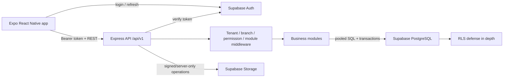
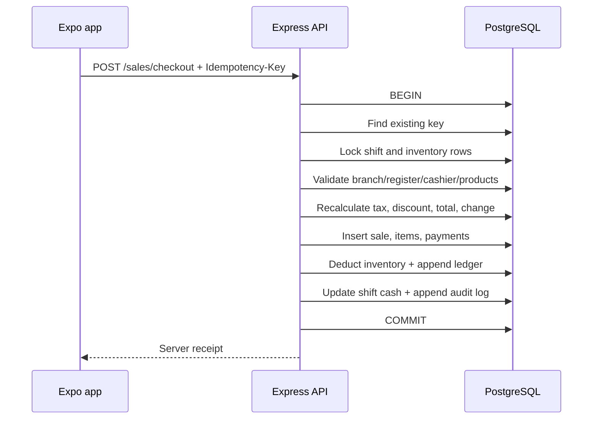

# Architecture

## System shape

Ximo POS is a modular monolith. This keeps financial transactions inside one PostgreSQL transaction
while preserving module boundaries that can be extracted later if scale warrants it.

For the shared official-website and future multi-product architecture, see
[Ximo multi-product platform foundation](platform-foundation.md). Supabase Auth is the global
identity provider, `organizations` are the tenant boundary, and `applications` namespace plans,
subscriptions, roles, and entitlements.

## Request authorization

1. Supabase Auth issues the mobile session.
2. The app stores that session through Expo SecureStore and sends its access token to the API.
3. The API verifies the token with Supabase.
4. A single context query loads the active profile, organization, role permissions, effective plan
   modules, module overrides, and permitted branches.
5. Route middleware enforces required permission, module, and branch.
6. Every SQL statement still includes the derived `organization_id`, and branch-owned statements
   include the verified `branch_id`.
7. RLS repeats tenant isolation as defense in depth.

Owner and administrator roles receive all active branches in their organization. Other users receive
only `user_branches` assignments. No code contains special handling for a specific organization ID.

## Mobile state

- TanStack Query owns server state, caching, retries, and pagination.
- Zustand owns only the active cart, active branch, and active shift.
- Active branch and shift identifiers use SecureStore so application restart can restore the
  cashier context.
- FlatList and 30-item pages keep product, inventory, and sales screens responsive on low-end
  Android devices.
- Checkout disables repeat submission while the mutation is pending and sends an idempotency key.
- The client displays an estimate, but PostgreSQL-backed server code recalculates prices, discounts,
  tax, payment equality, inventory, and change.

## Checkout transaction

Any failure throws before commit and the database adapter rolls the whole transaction back.

## Extension seams

- Offline sync: introduce a local Expo SQLite outbox and versioned aggregate sync endpoints. UUIDs,
  timestamps, immutable movements, and idempotency keys already support replay.
- Suppliers/purchasing/expenses: add modules and ledgers without changing tenant context.
- E-commerce/accounting: create outbound event records in the same transaction, then publish from an
  outbox worker.
- Loyalty/promotions: add server-side pricing policies before sale insertion; never make the app the
  pricing authority.
- Hardware: place printer/scanner adapters behind mobile interfaces. Barcode text entry already
  follows the same product-search endpoint.
- Public API: use separate credentials, scopes, rate limits, and audit policy rather than exposing the
  internal mobile routes.
