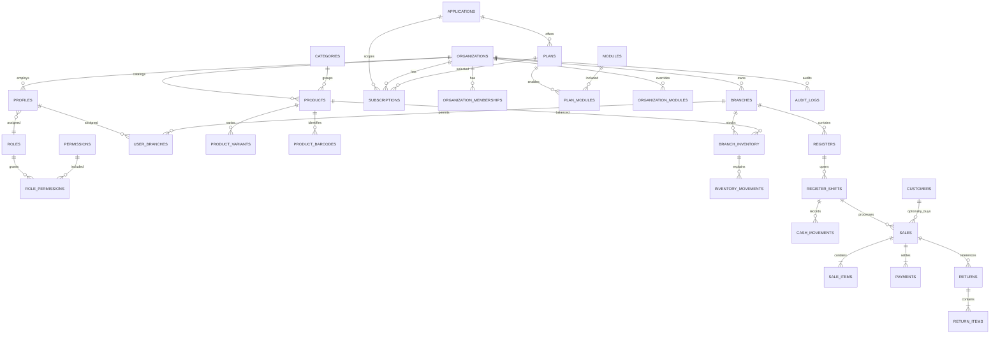

# Database design

All primary keys are UUIDs. Money is `numeric(14,2)` and is transported as decimal strings. The
TypeScript shared package converts decimal strings to `bigint` minor units for exact arithmetic.
Timestamps are `timestamptz` in UTC; clients display them using `organizations.timezone`.

## Invariants

- Composite foreign keys such as `(branch_id, organization_id)` prevent cross-tenant relationships.
- SKU and barcode uniqueness is per organization.
- Receipt and return numbers are unique per organization; each embeds branch/date context where
  appropriate.
- Partial unique indexes permit only one open shift per register and one open shift per cashier.
- Completed sale rows have lifecycle statuses instead of deletion.
- Inventory movements, payments, returns, return items, and audit logs reject updates/deletes through
  immutable-ledger triggers.
- A sale item tracks cumulative returned quantity with a check that it cannot exceed quantity sold.
- RLS policies compare tenant-owned rows with the authenticated profile's organization.
- Storage writes are server-only and paths start with the organization UUID.

## Effective modules

The API resolves each module as:

1. use an `organization_modules` override if present;
2. otherwise check the active/trialing subscription's `plan_modules`.

Starter, Business, Professional, and Enterprise mappings are in `supabase/seed.sql`.

Migration `0032_multi_product_platform_foundation.sql` assigns these legacy modules and plans to
the `ximo_pos` application and mirrors them into normalized application entitlements. See
[platform-foundation.md](platform-foundation.md) for the ownership model and rollout order.

## Migration order

Apply `0005_owner_invitations.sql` after `0004_platform_provisioning.sql`; it adds owner invitation
timestamps and database-backed resend protection.

- `0001_initial_schema.sql` — relational schema, indexes, triggers, RLS, and helper functions
- `0002_storage_policies.sql` — product-image bucket and read policy
- `0003_platform_api.sql` — hashed API clients and immutable platform audit history
- `0004_platform_provisioning.sql` — onboarding plan metadata and idempotent provisioning records
- `seed.sql` — repeatable development structural data
