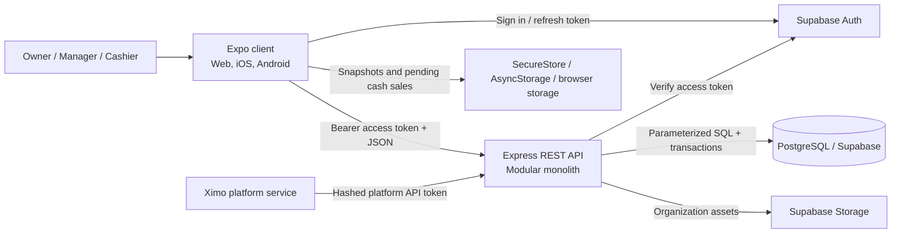
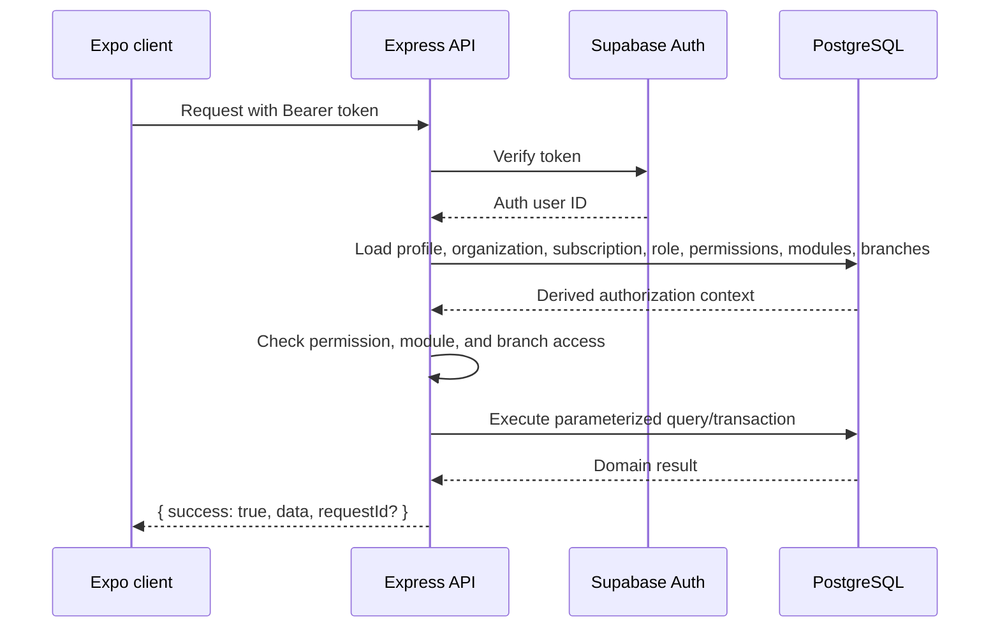
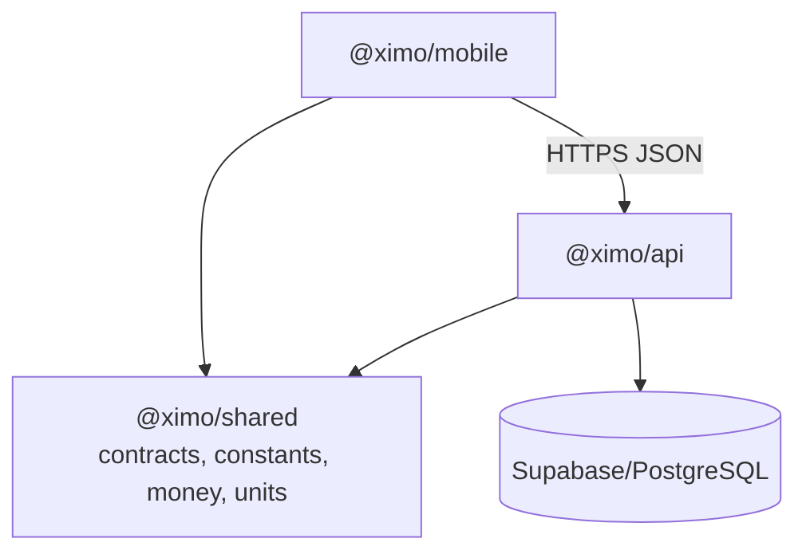
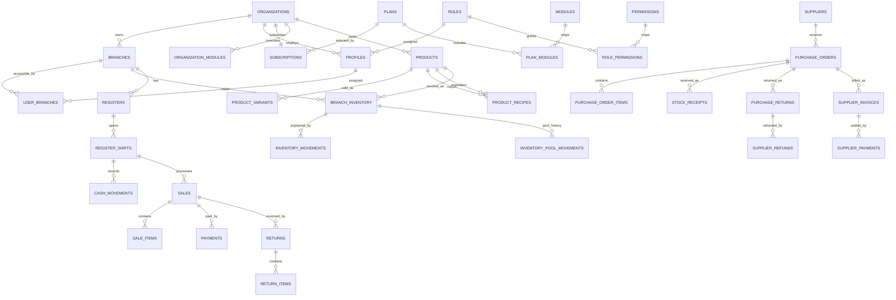
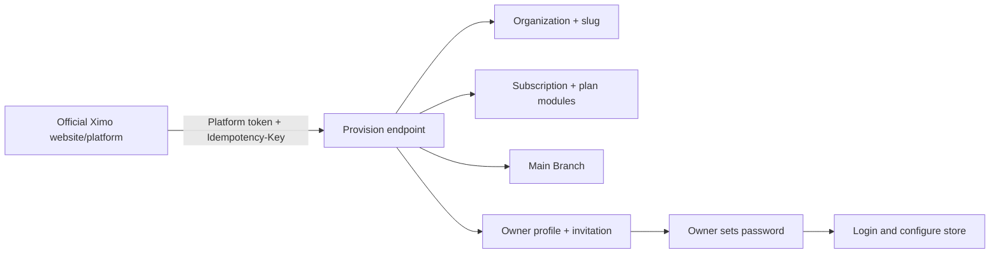
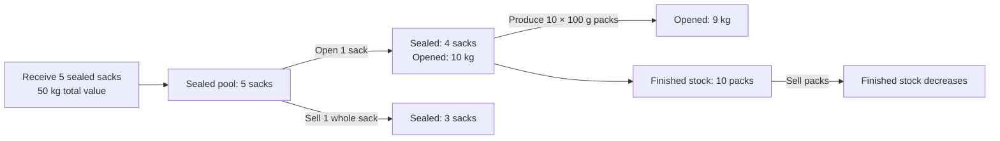
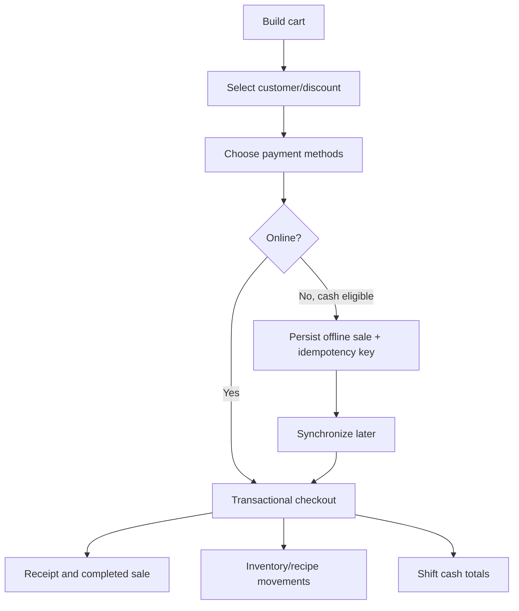
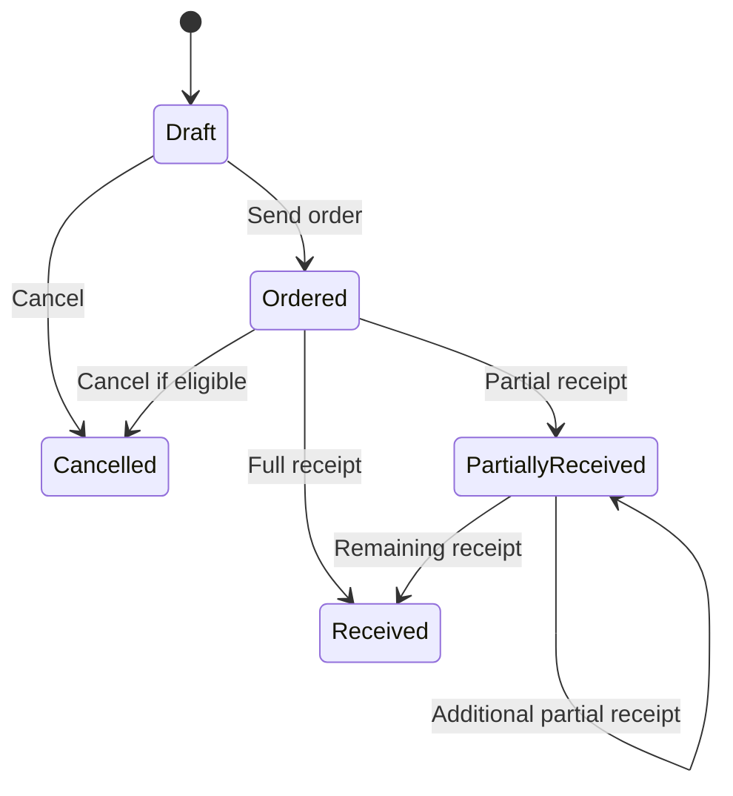
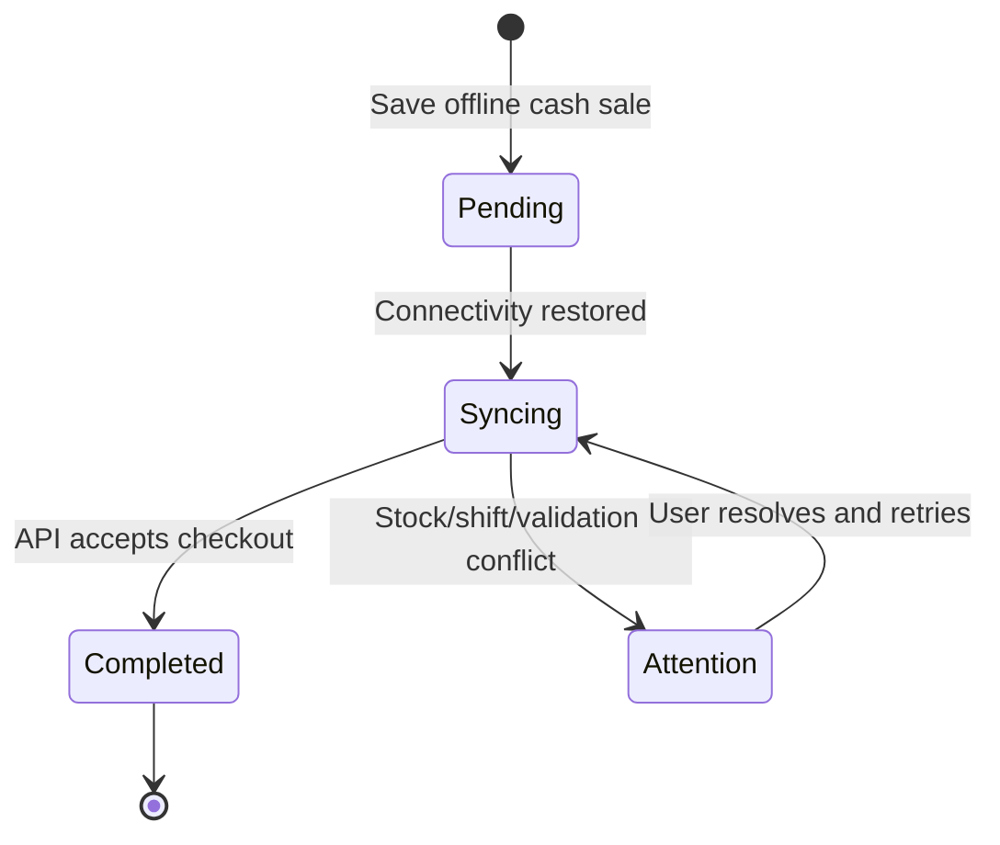

# Ximo POS System Documentation

> **Audience:** developers, maintainers, technical operators, and implementation partners  
> **Repository:** `ximo-pos`  
> **Document status:** implementation-aligned as of 2026-08-02  
> **Source of truth:** application code and ordered Supabase migrations. Where this document conflicts with an older planning document, verify the current code and latest migration.

Ximo POS is a multi-tenant, branch-aware point-of-sale and retail operations platform. A single Expo application serves web, iOS, and Android clients; an Express API owns business rules and tenant enforcement; PostgreSQL/Supabase provides relational storage, authentication, and object storage.

This handbook documents what is currently implemented, how the pieces interact, and which areas remain partial or planned. It is intended to be read independently of the original feature discussions.

## Table of contents

1. [System overview and purpose](#1-system-overview-and-purpose)
2. [Architecture](#2-architecture)
3. [Repository structure](#3-repository-structure)
4. [Technology stack](#4-technology-stack)
5. [Database design](#5-database-design)
6. [Authentication, authorization, and tenancy](#6-authentication-authorization-and-tenancy)
7. [API conventions and endpoint reference](#7-api-conventions-and-endpoint-reference)
8. [Backend modules and services](#8-backend-modules-and-services)
9. [Frontend application](#9-frontend-application)
10. [Business workflows](#10-business-workflows)
11. [Offline operation and synchronization](#11-offline-operation-and-synchronization)
12. [Reports and exports](#12-reports-and-exports)
13. [Hardware and third-party integrations](#13-hardware-and-third-party-integrations)
14. [Configuration and environment variables](#14-configuration-and-environment-variables)
15. [Local development and installation](#15-local-development-and-installation)
16. [Deployment](#16-deployment)
17. [Error handling, logging, and observability](#17-error-handling-logging-and-observability)
18. [Security considerations](#18-security-considerations)
19. [Testing strategy](#19-testing-strategy)
20. [Performance and scalability](#20-performance-and-scalability)
21. [Known limitations](#21-known-limitations)
22. [Future improvements](#22-future-improvements)
23. [Developer maintenance guide](#23-developer-maintenance-guide)
24. [Glossary](#24-glossary)

---

## 1. System overview and purpose

### 1.1 Product purpose

Ximo POS supports small and growing retail businesses—including sari-sari stores, groceries, eateries, and mixed retail/food operations—from one organization account. Its domain model covers:

- multiple branches under one organization;
- owner, administrator, manager, cashier, and inventory staff access;
- products sold by piece, package, weight, volume, or serving;
- raw ingredients, sellable products, and products that serve both roles;
- sealed bulk containers and opened portion stock;
- recipes (BOM), prepared food, and repacking/production;
- checkout, payments, receipts, returns, and held sales;
- registers, cashier shifts, cash movements, and cash variance;
- suppliers, purchase orders, receiving, supplier returns, invoices, payments, and refunds;
- branch inventory, adjustments, transfers, immutable movement history, and weighted-average costing;
- customers, reports, exports, audit logs, configurable modules, and offline cash checkout.

### 1.2 Runtime surfaces

| Surface | Package | Purpose |
|---|---|---|
| Web POS/admin | `apps/mobile` exported for web | Responsive browser UI, including desktop sidebar and tablet/phone layouts |
| iOS/Android app | `apps/mobile` | Native Expo application using the same routes and shared UI |
| Business API | `apps/api` | Authenticated REST API, transaction boundaries, permissions, validation, and tenant scoping |
| Shared contracts | `packages/shared` | Zod request schemas, domain constants, money helpers, and unit conversion |
| Data platform | `supabase` | PostgreSQL schema/migrations, Supabase Auth, RLS policies, and Storage policies |

### 1.3 Implementation status legend

| Status | Meaning |
|---|---|
| **Implemented** | End-to-end code and persistence exist |
| **Partial** | Some UI/schema/API support exists, but important behavior or production hardening remains |
| **Planned** | Module catalogue or product plan may reference it, but no complete business implementation exists |

The current system is a functional modular monolith. It is not yet a collection of microservices, and module enablement does not imply that every future feature associated with a module is complete.

### 1.4 Sixty-feature implementation matrix

This matrix maps the agreed product catalogue to the current repository. “Partial” is deliberate: it means useful implementation exists but the full named capability is not complete.

| # | Feature | Status | Current implementation or gap |
|---:|---|---|---|
| 1 | Authentication | **Implemented** | Supabase login, session, current-user context, reset/invitation flows |
| 2 | Organizations | **Implemented** | Tenant identity, slug/ID, logo, summaries, private platform provisioning |
| 3 | Subscriptions and Plans | **Implemented** | Plans, status, periods, plan modules, platform administration |
| 4 | Module Enable/Disable Management | **Implemented** | Plan defaults and organization overrides; no per-branch override |
| 5 | Branch Management | **Implemented** | CRUD, active state, branch assignment/access |
| 6 | Users, Roles, and Permissions | **Implemented** | Employee invitation, five roles, editable permissions, branch assignments |
| 7 | Audit Logs | **Implemented** | Organization and separate platform audit views/tables |
| 8 | Dashboard | **Implemented** | Branch-aware KPI/dashboard surface |
| 9 | Products | **Implemented** | Catalogue CRUD, status, barcode/SKU, inventory role, images/reference |
| 10 | Categories, Brands, and Units | **Implemented** | API/schema and catalogue metadata; category UI intentionally simplified |
| 11 | Product Variants | **Implemented** | Alternate SKU/barcode/unit, price, base conversion, container flag |
| 12 | Pricing | **Implemented** | Cost/price/tax, weighted cost, margin and selling-price suggestions |
| 13 | POS Checkout | **Implemented** | Responsive product/cart, exact server checkout, idempotency |
| 14 | Payments | **Partial** | Cash/card/e-wallet records and split tenders; no gateway capture/reconciliation |
| 15 | Receipts and Invoices | **Partial** | Customer receipts/printing exist; full customer invoicing lifecycle does not |
| 16 | Sales History | **Implemented** | Paginated history and detail |
| 17 | Returns, Exchanges, and Refunds | **Partial** | Returns/refunds/restock complete; exchanges are not a distinct workflow |
| 18 | Orders and Held Sales | **Partial** | Held/resume/delete sales exist; general customer order fulfillment does not |
| 19 | Registers and Devices | **Partial** | Registers complete; several physical device drivers remain interfaces only |
| 20 | Cashier Shifts | **Implemented** | Open/close, float, expected/count/variance |
| 21 | Cash Movements | **Implemented** | Reasoned cash-in/out including purchasing/refund effects |
| 22 | Customers | **Implemented** | Directory, update, purchase history |
| 23 | Customer Groups and Accounts | **Planned** | No complete groups/account-ledger implementation |
| 24 | Branch Inventory | **Implemented** | Current branch balances, cost/value, pools |
| 25 | Inventory Movement Ledger | **Implemented** | Immutable business and pool movement history |
| 26 | Stock Adjustments | **Implemented** | Specific product, quantity, reason, and pool |
| 27 | Stock Counts | **Planned** | No full count session/variance approval workflow |
| 28 | Stock Transfers | **Implemented** | Dispatch, receive, cancel, branch ledgers |
| 29 | Inventory Alerts | **Partial** | Low/out-of-stock KPIs/settings; notification delivery is incomplete |
| 30 | Suppliers | **Implemented** | Supplier directory and maintenance |
| 31 | Purchase Orders | **Implemented** | Draft/send/cancel/detail and partial lifecycle |
| 32 | Stock Receiving | **Implemented** | Partial/full receiving, base conversion, weighted cost |
| 33 | Purchase Returns | **Implemented** | Quantity controls, reason, resolution, stock deduction |
| 34 | Basic Discounts | **Implemented** | Fixed/percentage sale discount contracts and checkout calculation |
| 35 | Advanced Promotions | **Partial** | Definitions/scheduling/activation exist; automatic checkout engine is absent |
| 36 | Expenses | **Planned** | Module code exists without full expense ledger/UI |
| 37 | Sales Reports | **Implemented** | KPIs, trend, payment/category/product/branch views |
| 38 | Inventory Reports | **Implemented** | Value, stock status, movement/adjustment-oriented data |
| 39 | Purchasing Reports | **Implemented** | Orders, received/returned, payable/payment summaries |
| 40 | Profit Reports | **Implemented** | Sales, COGS, gross profit/margin based on recorded cost |
| 41 | Cash and Shift Reports | **Implemented** | Shift list/detail, movements, expected/count/variance |
| 42 | Report Export | **Implemented** | Responsive PDF and styled multi-sheet Excel export |
| 43 | Business Settings | **Implemented** | Business identity and operational settings |
| 44 | Tax Settings | **Implemented** | Default/product tax and inclusive behavior |
| 45 | Payment Method Settings | **Implemented** | Configurable enabled methods; gateways are separate future work |
| 46 | Receipt Settings | **Implemented** | Header/footer and print-related configuration |
| 47 | Notification Settings | **Partial** | Configuration concepts exist; delivery channels/jobs are incomplete |
| 48 | Loyalty and Rewards | **Planned** | Module catalogue only |
| 49 | Gift Cards | **Planned** | No dedicated liability ledger/redemption flow |
| 50 | Store Credit | **Planned** | No dedicated credit ledger |
| 51 | Customer Credit Sales | **Planned** | No accounts-receivable/collection workflow |
| 52 | Accounting Integration | **Planned** | No production adapter |
| 53 | E-commerce Integration | **Planned** | Tenant identifiers are ready; sync/order adapter is not |
| 54 | Public API and Webhooks | **Partial** | Private privileged platform API exists; public scoped API/webhooks do not |
| 55 | Offline Mode and Synchronization | **Partial** | Cached data and queued cash sales; not full offline administration |
| 56 | Advanced Analytics | **Partial** | Consolidated KPIs/reports exist; forecasting/cohorts are not advanced yet |
| 57 | Data Import and Migration | **Planned** | No guided CSV/import mapping pipeline |
| 58 | Scheduled Reports | **Planned** | Client exports exist; no scheduler/email worker |
| 59 | Support and Priority Support | **Planned/operational** | Commercial process, not a complete in-product ticketing module |
| 60 | Backups, Recovery, and System Operations | **Partial** | Provider/manual operations only; no application orchestration or restore UI |

---

## 2. Architecture

### 2.1 High-level architecture



### 2.2 Request lifecycle



The client never supplies a trusted organization boundary. The API derives `organizationId`, accessible branch IDs, permissions, and enabled modules from the authenticated user. Route handlers must apply those derived values to every query.

### 2.3 Architectural style and boundaries

- **Modular monolith:** each API domain has a router and, for transaction-heavy domains, a dedicated service.
- **Contract-first validation:** `@ximo/shared` Zod schemas validate API and frontend values.
- **Service-owned writes:** sensitive writes go through the Express API using server-only credentials; direct anonymous database writes are not the business path.
- **Transactional ledgers:** checkout, returns, receiving, transfers, production, and cash operations update summaries and append history in one database transaction.
- **Defense in depth:** API authorization is primary; PostgreSQL RLS adds tenant read isolation.
- **Exact monetary arithmetic:** public money values are decimal strings; shared helpers use integer minor units where calculations must be exact.
- **Cross-platform UI:** Expo Router routes render through React Native and React Native Web.

### 2.4 Shared package dependency direction



`@ximo/shared` must not depend on either application. It should remain runtime-portable and free of Node-only or React Native-only APIs.

---

## 3. Repository structure

```text
ximo-pos/
├── apps/
│   ├── api/
│   │   ├── src/
│   │   │   ├── auth/             # Supabase user authentication adapters
│   │   │   ├── config/           # Environment validation
│   │   │   ├── database/         # PostgreSQL pool and transaction abstractions
│   │   │   ├── middleware/       # Authentication, RBAC, validation, errors
│   │   │   ├── modules/          # REST modules; see section 8
│   │   │   ├── platform/         # Platform token and provisioning services
│   │   │   ├── scripts/          # Demo users and platform token creation
│   │   │   ├── storage/          # Supabase asset storage adapter
│   │   │   ├── app.ts            # Express composition and route mounting
│   │   │   └── server.ts         # Process startup and graceful shutdown
│   │   └── package.json
│   └── mobile/
│       ├── app/                   # Expo Router screens and route groups
│       ├── assets/                # Bundled logo and static application assets
│       ├── public/                # Web manifest/service worker/static web assets
│       ├── scripts/               # Web export helpers
│       ├── src/
│       │   ├── components/        # Shared UI and sidebar/navigation components
│       │   ├── hardware/          # Hardware interfaces and drivers
│       │   ├── lib/               # API, exports, storage, calculations
│       │   ├── providers/         # Session, offline, alerts
│       │   ├── store/             # Zustand stores
│       │   └── test/              # Test setup/helpers
│       ├── app.json               # Expo application configuration
│       └── package.json
├── packages/
│   └── shared/
│       └── src/
│           ├── api.ts             # Shared response/context types
│           ├── constants.ts       # Roles, permissions, modules, payment methods
│           ├── money.ts           # Exact money helpers
│           ├── schemas.ts         # Zod input contracts
│           └── units.ts           # Recipe/unit conversion helpers
├── supabase/
│   ├── migrations/                # Ordered schema evolution, 0001 through 0025
│   └── seed.sql                   # Plans, modules, roles, permissions, demo domain data
├── docs/                          # Focused documents plus this handbook
├── .env.example                   # Safe environment template
├── package.json                   # Workspace scripts
├── pnpm-workspace.yaml            # pnpm workspace declaration
├── eslint.config.mjs              # Lint configuration
├── tsconfig.base.json             # Shared TypeScript settings
└── README.md                      # Quick-start guide
```

### 3.1 Important entry points

| File | Responsibility |
|---|---|
| `apps/api/src/app.ts` | Creates Express middleware, health endpoints, protected routers, and error handling |
| `apps/api/src/server.ts` | Loads dependencies, opens the HTTP server, and handles shutdown signals |
| `apps/mobile/app/_layout.tsx` | Installs global providers, service worker registration, and root navigation |
| `apps/mobile/src/lib/api.ts` | Authenticated API client, response normalization, and selected offline fallback behavior |
| `apps/mobile/src/providers/session.tsx` | Session lifecycle and current-user context |
| `apps/mobile/src/providers/offline.tsx` | Connectivity checks, snapshots, and synchronization status |
| `packages/shared/src/schemas.ts` | Canonical input validation used by clients and API |
| `supabase/migrations/0001_initial_schema.sql` | Initial data model and core tenant controls |
| `supabase/seed.sql` | Default plans, modules, roles, permissions, and seed records |

### 3.2 Migration history

| Migration | Adds or changes |
|---|---|
| `0001` | Core SaaS, catalogue, inventory, sales, customers, registers, shifts, RLS, and audit schema |
| `0002` | Supabase Storage bucket/policies |
| `0003` | Platform API clients, scopes, idempotency, and platform audit |
| `0004` | Organization provisioning support |
| `0005` | Owner invitation lifecycle |
| `0006` | Hardware module catalogue |
| `0007` | Product units |
| `0008` | Weighted products and untracked products |
| `0009` | Multiple product selling units/variants |
| `0010` | Managed categories, brands, and catalogue units |
| `0011` | Cash shift accountability and refund effects |
| `0012` | Suppliers, purchase orders, receiving, and purchase returns |
| `0013` | Incoming/pending-receipt products |
| `0014` | Weighted-average inventory costing |
| `0015` | Supplier invoices and payments |
| `0016` | Supplier refunds |
| `0017` | Inter-branch stock transfers |
| `0018` | Promotion definitions |
| `0019` | Manager PIN support |
| `0020` | Audit module entitlement |
| `0021` | Product recipes/BOM |
| `0022` | Portionable selling units |
| `0023` | Sealed/opened inventory pools |
| `0024` | Product inventory roles (`sellable`, `ingredient`, `both`) |
| `0025` | Production/repacking batches |

Never rename or edit an applied migration. Add a new numbered migration for every production schema change.

---

## 4. Technology stack

### 4.1 Runtime and language

| Technology | Version/constraint | Use |
|---|---:|---|
| Node.js | `>=22 <25` | API, scripts, builds, tests |
| TypeScript | `5.9.x` | All application and shared source |
| pnpm | `11.9.0` | Workspace package manager |
| PostgreSQL | Supabase-managed or compatible | Transactional data store |

### 4.2 Backend

| Library | Use |
|---|---|
| Express `5.2` | REST routing and middleware |
| `pg` | PostgreSQL pooling, parameterized queries, transactions |
| Supabase JS `2.110` | Auth administration/token verification and Storage |
| Zod `4.4` | Runtime environment/request validation |
| Helmet | HTTP security headers |
| CORS | Cross-origin API access |
| express-rate-limit | Login and platform endpoint throttling |
| pino-http | Structured request logging |
| Vitest + Supertest | Unit/service/router tests |

### 4.3 Frontend

| Library | Use |
|---|---|
| Expo `54` + Expo Router `6` | Cross-platform runtime and file-based navigation |
| React `19.1` / React Native `0.81` | UI framework |
| React Native Web | Browser rendering |
| TanStack Query `5` | Server-state cache, loading, retry, mutation lifecycle |
| Zustand `5` | Cart, branch, shift, and connectivity state |
| React Hook Form + Zod | Form state and validation |
| NativeWind + Tailwind CSS | Cross-platform utility styling |
| Expo Camera | Barcode scanning through device camera |
| SecureStore / AsyncStorage | Tokens and cross-platform persisted state |
| `pdf-lib` | Client-side report PDF generation |
| `xlsx-js-style` | Styled Excel exports |
| Vitest + Jest + Testing Library | Library/store and React Native UI tests |

### 4.4 Why one Expo client?

One route and component system reduces duplication between browser, tablet, and phone. Platform-specific behavior is isolated behind `Platform.OS`, storage helpers, file download/share helpers, service worker code, and hardware adapters. Responsive screens still require explicit layout testing because native and web interaction models are not identical.

---

## 5. Database design

### 5.1 Core relationship diagram



### 5.2 Table groups

#### SaaS, tenancy, and access

| Tables | Purpose |
|---|---|
| `organizations` | Top-level tenant; name, slug, currency, timezone, logo |
| `branches` | Locations under one organization |
| `plans`, `subscriptions` | Commercial plan and organization subscription status |
| `modules`, `plan_modules`, `organization_modules` | Plan defaults and organization-level enable/disable overrides |
| `profiles`, `roles`, `permissions`, `role_permissions`, `user_branches` | Users, RBAC, and branch assignment |
| `organization_settings` | Tax, receipt, payment, inventory, and margin settings |
| `audit_logs` | Organization-facing audit history |

#### Platform operations

| Tables | Purpose |
|---|---|
| `platform_api_clients` | Hashed server-to-server platform tokens and scopes |
| `platform_idempotency_keys` | Safe replay of organization provisioning |
| `platform_audit_logs` | Immutable platform administration events |

#### Product catalogue and inventory

| Tables | Purpose |
|---|---|
| `categories`, `brands`, `product_units` | Organization catalogue metadata |
| `products` | Product identity, role, tax, base unit, status, cost, and price |
| `product_variants`, `product_barcodes` | Alternate selling units/SKUs/barcodes and conversion to base stock |
| `product_recipes` | BOM lines from a finished product to ingredient products |
| `branch_inventory` | Current branch quantity, sealed/opened pools, average cost, and value |
| `inventory_movements` | Immutable business movement ledger |
| `inventory_pool_movements` | Sealed/opened pool transfer history |
| `stock_transfers`, `stock_transfer_items` | Dispatch and receipt between branches |
| `production_batches`, `production_batch_items` | Repacking/preparation consumption and finished output |

#### Sales, cash, and customers

| Tables | Purpose |
|---|---|
| `customers` | Organization customer directory and optional contact/account data |
| `registers` | Physical/logical checkout devices at a branch |
| `register_shifts` | Opening float, expected cash, counted cash, and variance |
| `cash_movements` | Cash-in/cash-out outside checkout |
| `sales`, `sale_items`, `payments` | Held/completed sales, server-calculated lines, and tenders |
| `returns`, `return_items` | Customer return/refund records |

#### Purchasing

| Tables | Purpose |
|---|---|
| `suppliers` | Organization supplier directory |
| `purchase_orders`, `purchase_order_items` | Draft/ordered procurement intent |
| `stock_receipts`, `stock_receipt_items` | Actual delivered quantities and costs |
| `purchase_returns`, `purchase_return_items` | Stock returned to supplier |
| `supplier_invoices`, `supplier_payments` | Accounts payable and payment source |
| `supplier_refunds` | Money/credit received for supplier returns |

#### Promotions

| Tables | Purpose |
|---|---|
| `promotions`, `promotion_items` | Promotion definition, date range, type, eligibility, and product links |

### 5.3 Data types and invariants

- Primary IDs are UUIDs.
- Financial values use PostgreSQL `numeric`, typically `numeric(14,2)` for user-facing money and higher precision for average/inventory cost.
- Quantities support thousandths where weight/volume requires decimals.
- Timestamps are `timestamptz` and should be interpreted as UTC; display uses organization timezone.
- SKU, barcode, branch code, sale number, purchase number, and similar identifiers have organization-scoped unique constraints.
- Composite organization foreign keys prevent cross-tenant relationship mistakes.
- A register/cashier cannot have conflicting open shifts; partial unique indexes enforce the active state.
- Movement ledgers are append-only at the application level and guarded by database triggers where defined.
- Received quantity cannot exceed ordered quantity; purchase return quantity cannot exceed received-minus-returned quantity.
- Customer returns cannot exceed the sale item quantity already sold minus prior returns.
- Negative inventory behavior is controlled by organization settings and service validation.

### 5.4 Inventory quantities and cost

`branch_inventory` is the fast current-state projection. `inventory_movements` explains how it changed. Do not reconstruct ordinary screens from the complete ledger unless auditing.

For bulk ingredients, total stock can be split into:

- **sealed quantity:** unopened containers available for complete-container sale or opening;
- **opened quantity:** measured stock available to recipes and portions.

Opening one 10 kg sack transfers one sealed sack into 10 kg of opened stock. It does not create value or change total inventory value. A later 100 g production line consumes 0.1 kg from the opened pool.

Receiving uses weighted-average costing:

```text
new average cost =
  (existing inventory value + received inventory value)
  / (existing base quantity + received base quantity)
```

Existing selling prices are never silently changed when costs change. The UI may calculate a review suggestion from the target margin.

### 5.5 Row Level Security

RLS policies use authenticated user/profile organization membership for tenant reads and storage paths. The API still performs explicit organization, branch, permission, and module checks. Enabling RLS is not a replacement for API authorization, especially because the server uses privileged credentials for controlled writes.

---

## 6. Authentication, authorization, and tenancy

### 6.1 User authentication

1. The login screen posts email/password to `POST /api/v1/auth/login`.
2. The API delegates credential verification to Supabase Auth.
3. The access/refresh session is returned to the client and persisted with platform-appropriate secure storage.
4. Subsequent API requests send `Authorization: Bearer <access-token>`.
5. The API verifies the token and loads the application profile and authorization context.
6. On logout, local session state is cleared and the API/Supabase sign-out path is invoked.

Password reset and owner invitations use Supabase email flows. `PLATFORM_OWNER_INVITE_REDIRECT_URL` must point to the deployed `/accept-invitation` page and be allowlisted in Supabase Auth redirect settings.

### 6.2 Authorization context

For every protected request, the server derives:

```ts
interface CurrentUserContext {
  userId: string;
  organizationId: string;
  role: 'owner' | 'administrator' | 'manager' | 'cashier' | 'inventory_staff';
  permissions: string[];
  modules: string[];
  accessibleBranchIds: string[];
  subscriptionStatus: string;
}
```

Middleware responsibilities:

| Middleware | Check |
|---|---|
| `authenticate` | Valid Supabase token and active application profile |
| `requirePermission(...)` | Role grants the requested action |
| `requireModule(...)` | Organization entitlement effectively enables the module |
| `requireAnyModule(...)` | At least one acceptable module is enabled |
| branch access guard | Requested branch belongs to the organization and is accessible to the user |
| validation middleware | Query/body conforms to the shared Zod contract |

Owner and administrator users receive access to all active branches in their organization. Other employees are limited by `user_branches`.

### 6.3 Roles and default permissions

The database is authoritative; administrators may edit role permissions from the UI. Seed defaults are:

| Role | Default intent and access |
|---|---|
| **Owner** | Full organization, branch, staff, catalogue, operations, reporting, settings, and audit access |
| **Administrator** | Full operational access similar to owner; ownership lifecycle remains an owner/platform concern |
| **Manager** | Broad day-to-day operations, staff supervision, purchasing, reports, and settings; plan/module administration is restricted |
| **Cashier** | Read branches/products/inventory/registers/customers; open/close shifts, move cash, create/read branch sales |
| **Inventory staff** | Read branches/products/inventory/suppliers/purchasing; manage catalogue, adjust stock, receive and return purchases |

Permission codes currently include:

```text
organization:read, organization:update
branches:read, branches:manage
users:read, users:manage
products:read, products:manage
inventory:read, inventory:adjust
transfers:read, transfers:manage, transfers:receive
suppliers:read, suppliers:manage
purchasing:read, purchasing:manage, purchasing:receive,
purchasing:return, purchasing:pay
registers:read, registers:manage
shifts:open, shifts:close, cash:move
sales:create, sales:read_branch, sales:read_all
returns:create, returns:manage
customers:read, customers:manage
promotions:read, promotions:manage
reports:read, settings:manage, audit:read
```

The frontend hides inaccessible navigation and actions, but this is only a UX convenience. The API check is mandatory.

### 6.4 Module entitlement

An effective module state is resolved in this order:

1. explicit `organization_modules` override, if present;
2. otherwise the selected plan's `plan_modules`, but only while subscription status is `trialing` or `active`;
3. otherwise disabled.

Module codes include `dashboard`, `pos`, `products`, `inventory`, `customers`, `returns`, `registers`, `reports`, `suppliers`, `purchasing`, `stock_transfers`, `expenses`, `promotions`, `loyalty`, `integrations`, and `audit`, plus hardware capabilities such as barcode scanner and receipt printer. `expenses`, `loyalty`, and general-purpose `integrations` are catalogue/planning capabilities rather than complete feature implementations.

Module overrides currently apply to the whole organization, not to individual branches. Branch-level capability overrides are a future extension.

### 6.5 Platform authentication

The separate `/api/v1/platform` surface is for Ximo's official SaaS/platform backend, not POS users or public browsers.

- Token format begins with `ximo_platform_`.
- Only a SHA-256 hash is stored.
- Scopes such as `platform:read` and `platform:write` gate endpoints.
- Actor headers can record an external platform actor ID/email.
- Provisioning requires `Idempotency-Key`.
- Platform actions are appended to `platform_audit_logs`.

Create a token locally with:

```powershell
pnpm --filter @ximo/api platform:token:create --name "Main website" --expires-days 365
```

Store the returned raw token in the platform service's secret manager. It is not recoverable from the database.

---

## 7. API conventions and endpoint reference

### 7.1 Base URLs

Local default:

```text
http://localhost:4000/api/v1
```

The root (`GET /`) and health (`GET /health`) endpoints are outside `/api/v1`. Production clients must configure the API **service** URL, not the static web URL.

### 7.2 Headers

```http
Authorization: Bearer <supabase-access-token>
Content-Type: application/json
X-Request-Id: optional-client-correlation-id
Idempotency-Key: required-for-checkout-and-platform-provisioning
```

The API returns/propagates an `x-request-id` value for support correlation.

### 7.3 Response envelopes

Successful single result:

```json
{
  "success": true,
  "data": {
    "id": "4e870476-e521-4d56-8d1c-ec9c0f2ca857",
    "name": "White Sugar"
  }
}
```

Successful page:

```json
{
  "success": true,
  "data": [{ "id": "...", "name": "White Sugar" }],
  "meta": { "page": 1, "pageSize": 20, "total": 1, "totalPages": 1 }
}
```

Error:

```json
{
  "success": false,
  "error": {
    "code": "INSUFFICIENT_STOCK",
    "message": "Opened ingredient stock is insufficient",
    "details": { "productId": "...", "required": 1, "available": 0.5 },
    "requestId": "0e9e763c-7d31-4ebc-937a-76d94b3cf418"
  }
}
```

Money is represented as a decimal string (for example, `"100.00"`). Dates are ISO 8601 with offsets. Never parse money through binary floating point for totals.

### 7.4 Pagination and filtering

List endpoints generally accept `page`, `pageSize`, and `search`; specialized endpoints add status, branch, plan, or date filters. Shared validation accepts `pageSize` up to 1000, but UI callers should use smaller pages unless exporting.

### 7.5 Endpoint catalogue

The permission/module column describes the primary guard; some routes add branch or ownership checks.

#### Public and authentication

| Method | Path | Input | Output/purpose |
|---|---|---|---|
| GET | `/` | none | API identity/status |
| GET | `/health` | none | Database connectivity health |
| POST | `/api/v1/auth/login` | email, password | Supabase session and current user |
| POST | `/api/v1/auth/password-reset` | email | Initiates password reset |
| GET | `/api/v1/auth/current` | Bearer token | Full user/permission/module/branch context |
| POST | `/api/v1/auth/logout` | Bearer token | Ends application session |

#### Organization, branches, and users

| Method | Path | Guard | Purpose |
|---|---|---|---|
| GET | `/organizations/current` | `organization:read` | Organization, subscription, branch/user/module summaries |
| PUT | `/organizations/current` | `organization:update` | Update name, currency, timezone, logo reference |
| POST | `/organizations/current/logo` | `organization:update` | Upload organization logo to scoped storage |
| GET/POST | `/branches` | `branches:read/manage` | List or create branches |
| PATCH | `/branches/:id` | `branches:manage` | Edit/activate/deactivate a branch |
| PUT | `/branches/:branchId/users/:userId` | `users:manage` | Assign/remove an employee at a branch |
| GET/POST | `/users` | `users:read/manage` | List or invite/create employees |
| GET/PATCH | `/users/:id` | `users:read/manage` | Employee detail/status/role/branches |
| PATCH | `/users/me/pin` | authenticated user | Change personal manager/cashier PIN |
| GET | `/users/roles` | `users:read` | Role and permission definitions |
| PATCH | `/users/roles/:id` | `users:manage` | Update a role permission set |

#### Products and catalogue

| Method | Path | Guard | Purpose |
|---|---|---|---|
| GET | `/products` | products/read module | Paginated product catalogue |
| GET | `/products/summary` | `products:read` | Product status/role summary cards |
| GET | `/products/lookup?code=` | `products:read` | Resolve SKU or barcode |
| POST | `/products` | `products:manage` | Create product, opening stock, and selling units atomically |
| GET/PATCH | `/products/:id` | `products:read/manage` | Product detail or update |
| GET/POST | `/products/:id/variants` | `products:read/manage` | List/create selling variants |
| PATCH | `/products/:productId/variants/:variantId` | `products:manage` | Update a selling variant |
| GET/PUT | `/products/:id/recipe` | `products:read/manage` | Read/replace BOM and optional cost override |
| GET/POST | `/categories` | `products:read/manage` | List/create categories |
| PATCH | `/categories/:id` | `products:manage` | Edit category |
| GET/POST | `/brands` | `products:read/manage` | List/create brands |
| PATCH | `/brands/:id` | `products:manage` | Edit brand |
| GET/POST | `/product-units` | `products:read/manage` | List/create catalogue units |
| PATCH | `/product-units/:id` | `products:manage` | Edit unit metadata |

#### Inventory and production

| Method | Path | Guard | Purpose |
|---|---|---|---|
| GET | `/inventory` | `inventory:read` | Branch inventory with filters |
| GET | `/inventory/summary` | `inventory:read` | Inventory KPI cards |
| GET | `/inventory/history` | `inventory:read` | Movement ledger |
| POST | `/inventory/adjustments` | `inventory:adjust` | Add/subtract a specific product/pool with reason |
| POST | `/inventory/open-portions` | `inventory:adjust` | Convert sealed containers to opened measured stock |
| GET | `/inventory/production-products` | inventory/products access | Finished products that have a BOM |
| POST | `/inventory/production` | `inventory:adjust` | Consume BOM and create finished stock |
| GET/POST | `/stock-transfers` | `transfers:read/manage` | List or dispatch transfers |
| GET | `/stock-transfers/:id` | `transfers:read` | Transfer detail |
| POST | `/stock-transfers/:id/receive` | `transfers:receive` | Receive dispatched stock |
| POST | `/stock-transfers/:id/cancel` | `transfers:manage` | Cancel eligible transfer |

#### Sales, returns, customers, and cash

| Method | Path | Guard | Purpose |
|---|---|---|---|
| POST | `/sales/hold` | `sales:create` | Save current cart as held sale |
| GET | `/sales/held` | sales read | List held branch sales |
| POST | `/sales/held/:id/resume` | `sales:create` | Resume held cart |
| DELETE | `/sales/held/:id` | `sales:create` | Delete held sale |
| POST | `/sales/checkout` | `sales:create` | Transactional checkout; idempotency required |
| GET | `/sales` | branch/all sales read | Paginated sales history |
| GET | `/sales/:id` | branch/all sales read | Sale, items, payments, and return state |
| POST | `/returns/sales/:saleId` | `returns:create` | Customer return/refund and optional restock |
| GET/POST | `/customers` | `customers:read/manage` | List/create customers |
| PATCH | `/customers/:id` | `customers:manage` | Edit customer |
| GET | `/customers/:id/history` | `customers:read` | Customer purchase history |
| GET/POST | `/registers` | `registers:read/manage` | List/create registers |
| POST | `/registers/shifts/open` | `shifts:open` | Open cashier shift with float |
| POST | `/registers/cash-movements` | `cash:move` | Record cash-in/cash-out |
| POST | `/registers/shifts/:shiftId/close` | `shifts:close` | Close shift with counted cash |

The registers router is also mounted under `/shifts` for compatibility. New clients should use `/registers/...` paths.

#### Purchasing

| Method | Path | Guard | Purpose |
|---|---|---|---|
| GET/POST | `/suppliers` | `suppliers:read/manage` | List/create suppliers |
| PATCH | `/suppliers/:id` | `suppliers:manage` | Edit supplier |
| GET/POST | `/purchase-orders` | `purchasing:read/manage` | List/create draft PO |
| GET | `/purchase-orders/returns` | `purchasing:read` | Supplier return register |
| GET | `/purchase-orders/:id` | `purchasing:read` | PO, receipts, returns, invoices, settlement |
| POST | `/purchase-orders/:id/send` | `purchasing:manage` | Move draft to ordered |
| POST | `/purchase-orders/:id/cancel` | `purchasing:manage` | Cancel eligible PO |
| POST | `/purchase-orders/:id/receipts` | `purchasing:receive` | Receive all/part; update cost and inventory |
| POST | `/purchase-orders/:id/returns` | `purchasing:return` | Return received stock to supplier |
| POST | `/purchase-orders/:id/invoices` | `purchasing:pay` | Record supplier invoice |
| POST | `/purchase-orders/invoices/:invoiceId/payments` | `purchasing:pay` | Record payment and source |
| POST | `/purchase-orders/returns/:returnId/refunds` | `purchasing:pay` | Record cash/bank/credit recovery |

#### Reports, settings, audit, promotions

| Method | Path | Guard | Purpose |
|---|---|---|---|
| GET | `/reports/workspace` | `reports:read` | Consolidated KPI/sales/inventory/purchasing/profit/cash dataset |
| GET | `/reports/summary` | `reports:read` | Compact legacy report summary |
| GET | `/reports/shifts` | `reports:read` | Shift report list |
| GET | `/reports/shifts/:id` | `reports:read` | Shift cash detail and variance |
| GET/PUT | `/settings` | read / `settings:manage` | Organization business settings |
| GET | `/audit` | audit module + `audit:read` | Filtered organization audit log |
| GET/POST | `/promotions` | `promotions:read/manage` | List/create promotion definitions |
| GET | `/promotions/:id` | `promotions:read` | Promotion detail |
| POST | `/promotions/:id/toggle` | `promotions:manage` | Activate/deactivate promotion |

#### Platform API

| Method | Path | Scope | Purpose |
|---|---|---|---|
| GET | `/platform/plans` | `platform:read` | Onboarding plans and included modules |
| GET | `/platform/modules` | `platform:read` | Module catalogue |
| GET | `/platform/organizations` | `platform:read` | Search/filter organizations |
| POST | `/platform/organizations` | `platform:write` | Idempotently provision organization, branch, subscription, and owner invite |
| GET | `/platform/organizations/:id` | `platform:read` | Organization detail |
| GET | `/platform/organizations/:id/modules` | `platform:read` | Effective plan/override status |
| POST | `/platform/organizations/:id/owner-invitation/resend` | `platform:write` | Resend owner setup invitation |
| PATCH | `/platform/organizations/:id/subscription` | `platform:write` | Change plan/status/period dates |
| PUT | `/platform/organizations/:id/modules/:code` | `platform:write` | Set override with reason |
| DELETE | `/platform/organizations/:id/modules/:code` | `platform:write` | Remove override and restore plan default |
| GET | `/platform/audit` | `platform:read` | Platform administration audit trail |

### 7.6 Request/response examples

#### Login

```http
POST /api/v1/auth/login
Content-Type: application/json

{
  "email": "cashier@example.com",
  "password": "a-long-password"
}
```

The response contains the Supabase session plus application user context. Do not log or expose the refresh token.

#### Create a raw bulk ingredient

```http
POST /api/v1/products
Authorization: Bearer <token>
Content-Type: application/json

{
  "branchId": "11111111-1111-4111-8111-111111111111",
  "name": "White Sugar",
  "sku": "SUGAR-WHITE-KG",
  "unit": "kg",
  "inventoryRole": "ingredient",
  "trackInventory": true,
  "cost": "50.00",
  "sellingPrice": "0.00",
  "taxRate": "0.00",
  "status": "active",
  "openingQuantity": 0,
  "openingContainerQuantity": 5,
  "sellingUnits": [
    {
      "name": "10 kg sack",
      "sku": "SUGAR-WHITE-SACK10",
      "unit": "sack",
      "unitsPerBase": 10,
      "cost": "500.00",
      "sellingPrice": "0.00",
      "isPortioningContainer": true
    }
  ]
}
```

This records five sealed sacks. Recipe/portion production consumes opened kilograms after stock is opened.

#### Save a repacking BOM

```http
PUT /api/v1/products/22222222-2222-4222-8222-222222222222/recipe
Authorization: Bearer <token>
Content-Type: application/json

{
  "items": [
    {
      "ingredientProductId": "33333333-3333-4333-8333-333333333333",
      "quantityRequired": 100,
      "unit": "g"
    }
  ]
}
```

#### Record production of ten 100 g packs

```http
POST /api/v1/inventory/production
Authorization: Bearer <token>
Content-Type: application/json

{
  "branchId": "11111111-1111-4111-8111-111111111111",
  "productId": "22222222-2222-4222-8222-222222222222",
  "quantityProduced": 10,
  "notes": "Morning repacking batch"
}
```

The service consumes `10 × 100 g = 1 kg` of raw sugar and creates ten sellable packs.

#### Checkout

```http
POST /api/v1/sales/checkout
Authorization: Bearer <token>
Idempotency-Key: checkout-device01-20260802-000123
Content-Type: application/json

{
  "branchId": "11111111-1111-4111-8111-111111111111",
  "registerId": "44444444-4444-4444-8444-444444444444",
  "shiftId": "55555555-5555-4555-8555-555555555555",
  "items": [
    { "productId": "22222222-2222-4222-8222-222222222222", "quantity": 2 }
  ],
  "payments": [
    { "method": "cash", "amount": "40.00", "tendered": "50.00" }
  ],
  "note": "Walk-in sale"
}
```

The server reloads price/tax/product/inventory data and computes trusted totals. Client-calculated totals are display estimates only.

#### Create a purchase order

```http
POST /api/v1/purchase-orders
Authorization: Bearer <token>
Content-Type: application/json

{
  "branchId": "11111111-1111-4111-8111-111111111111",
  "supplierId": "66666666-6666-4666-8666-666666666666",
  "expectedAt": "2026-08-05T09:00:00+08:00",
  "notes": "Weekly restock",
  "items": [
    {
      "productId": "33333333-3333-4333-8333-333333333333",
      "quantity": 5,
      "unitCost": "500.00"
    }
  ]
}
```

#### Provision an organization

```http
POST /api/v1/platform/organizations
Authorization: Bearer ximo_platform_<secret>
Idempotency-Key: website-order-948392
Content-Type: application/json

{
  "name": "Jethro Store",
  "currency": "PHP",
  "timezone": "Asia/Manila",
  "planCode": "business",
  "subscriptionStatus": "active",
  "ownerEmail": "owner@example.com",
  "ownerName": "Jethro Owner"
}
```

The operation creates the organization, readable slug, subscription, default Main Branch, owner profile/invitation, plan modules, idempotency record, and platform audit event in a controlled transaction/compensation flow.

---

## 8. Backend modules and services

### 8.1 Module pattern

Most API modules expose `routes.ts` as their HTTP controller. The router validates input and authorization, then either executes focused SQL or invokes a domain service for multi-step transactions. Dependencies are passed into router/service constructors: database, Supabase auth actions, storage, or clock-like test fakes.

Every new mutating workflow should:

1. validate with a shared schema;
2. derive organization and branch scope from auth context;
3. use a transaction when multiple records must agree;
4. lock mutable rows (`FOR UPDATE`) when concurrent updates could conflict;
5. append movement/audit records;
6. return the standard envelope;
7. include failure and authorization tests.

### 8.2 Module reference

| Module | What it does / how it works | Dependencies | Inputs and outputs | Important implementation |
|---|---|---|---|---|
| `organizations` | Reads/updates tenant identity and uploads a logo. Storage paths are organization-scoped; clients cache a usable logo for offline display. | DB, asset storage, auth context | Profile fields or image input → organization summary/logo path | organization router, storage adapter |
| `branches` | Creates and manages locations and employee assignments. Validates organization ownership and prevents cross-tenant assignment. | DB, RBAC | Branch fields/user ID → branch/user-branch rows | branch router and branch tests |
| `users` | Lists staff, creates Supabase users/profiles, assigns roles/branches, manages active state and PIN, edits role permissions. | DB, Supabase admin auth | Employee/role payload → profile and assignments | user router; shared `createEmployeeSchema` |
| `products` | Catalogue CRUD, SKU/barcode lookup, variants, inventory roles, recipes, cost suggestions, opening inventory. Product creation writes product, variants, inventory, and movement history atomically. | DB, units, money, RBAC | Product/BOM/variant payloads → catalogue resources | products router; recipe conversion helpers |
| `inventory` | Current inventory, KPIs, ledger, adjustments, sealed/opened conversion, and production. It locks stock rows and records every movement. | DB, product recipes, settings | Branch/product/qty/reason → balances and ledger events | inventory routes, `ProductionService` |
| `stock-transfers` | Dispatches stock from one accessible branch and receives it at another; transfer records preserve in-transit state and branch ledgers. | DB, branch access, inventory | Source/destination/items → transfer status/movements | transfer router/service logic |
| `suppliers` / `purchasing` | Supplier directory, PO lifecycle, partial receipts, incoming products, supplier returns, payables, payments, and refunds. Quantities/costs are converted to base inventory units. | DB, inventory costing, cash shifts | PO/receipt/return/invoice/payment → purchasing and inventory records | purchasing routes and calculation helpers |
| `registers` | Register creation, shift open/close, cash-in/out, expected cash, counted cash, and variance. | DB, sales/refund payments | Register/float/movement/count → shift state | `ShiftService` |
| `sales` | Held sales, checkout, history, sale detail. Checkout locks shift and stock, calculates trusted totals, persists items/payments, adjusts inventory and cash, and supports idempotent replay. | DB, money, inventory, settings | Cart/payments → completed sale/receipt data | `CheckoutService`, `calculateLine` |
| `returns` | Validates remaining returnable quantity, records refund payment, optionally restocks correct pool, adjusts shift cash, and updates sale status. | DB, sales, inventory, shifts | Sale/items/refund/restock → return record | `ReturnService` |
| `customers` | Customer directory and sales history under the organization. | DB, RBAC | Customer profile → customer/history | customer router |
| `reports` | Aggregates sales, inventory, purchasing, profit, and shift/cash data over date and branch scopes. | DB, permission/branch scope | Date range/branch → report workspace | reports router and report query helpers |
| `settings` | Persists business name, currency/timezone-related settings, tax, receipts, payment methods, margins, and negative stock behavior. | DB | Settings payload → effective settings | settings router |
| `audit` | Returns organization audit entries with filters/pagination. Mutating services append actor, event, and context data. | DB, audit module | Filters → audit page | audit router |
| `promotions` | Stores promotion definitions and activation state. | DB | Promotion type/rules/items → definition | promotion router; checkout evaluator is not yet connected |
| `platform` | Server-to-server plan/module discovery, organization onboarding, owner invitation, subscription/module administration, and platform audit. | DB, Supabase admin auth, hashed token auth | Platform request → provisioned organization/admin state | `PlatformProvisioningService`, `OwnerInvitationService` |

### 8.3 Database abstraction

`PostgresDatabase` wraps a `pg` pool and exposes query/transaction behavior. Current pool settings are tuned for a modest modular-monolith deployment (maximum 15 connections, 30-second idle timeout, 10-second connect timeout). Transactions use explicit `BEGIN`, `COMMIT`, and `ROLLBACK`, always releasing the client.

`DATABASE_SSL=true` enables provider-compatible TLS. The current compatibility setup does not enforce certificate-chain validation, so production operators should use a trusted managed private connection when possible and revisit strict verification for public database endpoints.

### 8.4 Checkout service

**Inputs:** authenticated organization/user, branch/register/shift, items, optional customer/discount/note, payments, idempotency key.  
**Outputs:** completed sale, itemized totals, payment/change and receipt data.  
**Dependencies:** PostgreSQL transaction, organization settings, product/variant data, branch inventory, active shift.

Key responsibilities:

- reject inactive or inaccessible products/branches/registers/shifts;
- load prices, tax, and unit conversion server-side;
- use exact money helpers for subtotal, discount, tax, total, paid, and change;
- validate tender/payment amounts;
- lock and deduct stock without race conditions;
- consume recipe ingredients at checkout for cooked-to-order recipe products;
- persist sale items, payments, movements, cash effects, and audit data atomically;
- replay an existing result for a repeated valid idempotency key.

Example usage is the checkout request in [section 7.6](#76-requestresponse-examples).

### 8.5 Production service

**Inputs:** branch, finished product, quantity produced, optional notes.  
**Outputs:** production batch, consumed items, calculated production cost, finished stock increase.  
**Dependencies:** product recipe, unit conversion, raw/opened inventory, weighted cost, inventory ledgers.

For each BOM line, required quantity is `recipe quantity × output quantity`. Compatible units convert between `g ↔ kg` and `ml ↔ l`. The service consumes the ingredient once during production, creates finished sellable units, and records both sides in one transaction. Checkout later deducts only the finished units. This prevents double consumption.

Prepared/cooked-to-order items may instead consume the recipe directly at checkout; the product setup flow distinguishes this from pre-produced/repacked stock.

### 8.6 Shared calculation utilities

| Function/concept | Purpose | Example |
|---|---|---|
| `moneyToMinor` | Decimal money string → integer minor units | `"12.50" → 1250n` |
| `minorToMoney` | Integer minor units → normalized string | `1250n → "12.50"` |
| `sumMoney` | Exact summation without float drift | `0.10 + 0.20 → "0.30"` |
| recipe/unit conversion | Converts compatible weight or volume quantities | `100 g → 0.1 kg` |
| `calculateBulkCostSuggestion` | Total container cost/contained amount → base cost | `₱500 / 10 kg → ₱50/kg` |
| purchase quantity conversion | Ordered variant/container quantity → base inventory | `5 sacks × 10 kg → 50 kg` |

---

## 9. Frontend application

### 9.1 Provider composition

`apps/mobile/app/_layout.tsx` initializes:

1. `SafeAreaProvider` for native insets;
2. TanStack `QueryClientProvider` (`staleTime: 30s`, one query retry, no mutation retry);
3. `SessionProvider` for authentication/current user;
4. `OfflineProvider` for connectivity, snapshots, and queue state;
5. `IosAlertProvider` for platform-consistent alerts;
6. Expo Router `Stack` for route transitions.

Production web builds register `/sw.js`; development removes service workers to avoid stale bundles during coding.

### 9.2 Navigation and responsive shell

- Large web layouts use a persistent left sidebar.
- Compact web/tablet/phone layouts hide the sidebar and expose a top-left hamburger; an outside click closes the overlay.
- Dashboard/home and POS remain prominent bottom-tab destinations for touch UX.
- Sidebar groups are filtered by both `currentUser.permissions` and `currentUser.modules`.
- The sidebar displays the active branch and current user, and uses a bundled Ximo logo so the base brand remains visible offline.

The navigation sections are Dashboard & POS, Sales & Orders, Product/Inventory, Customers, Purchasing, Promotions, Registers & Shifts, Income & Reports, and Settings & Admin.

### 9.3 Screen and page reference

| Route/screen | What it does | Dependencies | Main inputs/outputs |
|---|---|---|---|
| `(auth)/login` | Email/password login and error state | Session provider, auth API | credentials → session/navigation |
| `accept-invitation` | Owner/staff password setup from invitation | Supabase Auth redirect | invite tokens/new password → active account |
| `branch-select` | Chooses one accessible working branch | current user, branch store | branch selection → persisted active branch |
| `(tabs)/index` | Dashboard metrics/navigation | dashboard/report queries | branch/date → KPI cards |
| `(tabs)/pos` | Search/scan/category product selection; responsive split cart on wide screens | products, inventory, camera/hardware, cart store | scan/tap → cart line |
| `cart`, `payment`, `receipt` | Quantity edits, discount/customer, tenders, checkout, receipt | cart, shift, settings, checkout API | cart/payment → sale/receipt |
| `(tabs)/sales`, `sale/[id]` | Sales history and detail | sales API | filters/sale ID → sale detail |
| `return/[saleId]`, `returns` | Customer return/refund workflow and history | return API, shift | items/refund/restock → return |
| `products` | Searchable product list, status/role/cost cards, edit actions | product API | filters → catalogue |
| `product-form` | Four-step guided product/ingredient/prepared/repacked setup | shared schemas, catalogue, BOM, cost suggestion | form → product/recipe/opening stock |
| `product-variants` | Alternate SKU/barcode/unit management | variant API | product/variant values → variants |
| `product-scan` | Camera barcode capture | Expo Camera, module entitlement | camera code → lookup/form field |
| `catalogue` | Category and brand maintenance | catalogue API | name/details → category/brand |
| `(tabs)/inventory` | Sellable/raw inventory cards, quantities, warnings, links to actions | inventory API | branch/filter → current stock |
| `stock-adjustment` | Select specific product and add/deduct stock with a reason/pool | adjustment API | product/qty/reason → movement |
| `production` | Select BOM product and record finished batch | production API | product/output qty → batch |
| `stock-transfers` | Create/list/receive/cancel branch transfers | transfer API | branches/items → transfer |
| `purchasing` | Supplier/PO/returns/payables overview | purchasing API | filters → PO list/KPIs |
| `purchase-order-form` | Supplier selection/creation and draft PO lines | suppliers, products, PO API | supplier/items/costs → draft PO |
| `purchase-order/[id]` | Send, receive, return, invoice, pay, and refund one PO | purchasing API | lifecycle action → updated PO |
| `supplier-form` | Supplier creation/editing | suppliers API | supplier details → supplier |
| `registers` | Active shift, cash in/out, counted close, register list | register API, shift store | cash fields → movement/closed shift |
| `shift-reports`, `shift-report/[id]` | Shift history and cash variance | reports API | range/shift ID → report |
| `customers` | Customer list/create/edit/history entry point | customers API | customer fields → customer |
| `reports` | Responsive report workspace, date range, branch/tabs, PDF/Excel export | reports API, export libraries | range/scope → KPIs/charts/files |
| `promotions` | Promotion definition/activation management | promotions API | rule/products/dates → promotion |
| `organization` | Organization identity, plan/module/user/branch summaries and logo upload | organization API, image picker | profile/image → organization |
| `branches` | Branch CRUD and status | branches API | branch fields → branch |
| `users`, `employee-form`, `user/[id]`, `role/[id]` | Employee, assignment, role, permission, and status management | user API, Supabase invite | employee/role changes → access model |
| `settings` | Business, tax, payment, receipt, margin, inventory preferences | settings API | settings form → effective settings |
| `audit` | Filtered actor/action history | audit API | filters → audit page |
| `hardware` | Capability/driver status and setup guidance | hardware registry, module entitlement | device selection → driver status |
| `offline-sync` | Pending/failed offline operations and manual retry | offline queue | retry/resolve → queue state |

### 9.4 Product form workflow

The product form intentionally translates technical inventory concepts into guided choices:

1. **Product Setup** — product identity and closest business behavior.
2. **Recipe or Repacking BOM** — conditional step for prepared/repacked items.
3. **Pricing & Tax** — total supplier package cost can generate a base cost suggestion; selling-price suggestion remains reviewable.
4. **Inventory & Units** — tracking behavior, opening stock, package size, alternate selling units, sealed/opened setup.
5. **Availability** — active/status/branch availability and save.

The screen may display four top-level tabs while conditionally rendering BOM content within setup; always treat the current form code and Zod schema as authoritative.

Product inventory roles:

| Role | Use |
|---|---|
| `sellable` | Appears as stock that can be sold; not offered as a raw ingredient by default |
| `ingredient` | Raw/packaging input for recipes or production; normally hidden from POS |
| `both` | Can be sold and selected as an ingredient, for cases such as a bottled drink also used in a recipe |

The BOM ingredient picker should prioritize `ingredient` and `both` products. Sellable-only choices are intentionally excluded unless the workflow explicitly supports whole-unit consumption, preventing misleading piece-only sources from appearing for gram-based repacking.

### 9.5 State management

| State type | Tool | Examples |
|---|---|---|
| Server state | TanStack Query | products, reports, users, purchasing detail |
| Transactional client state | Zustand | cart, active branch, active shift, connectivity |
| Authentication | Session provider + secure storage | tokens and current user |
| Forms | React Hook Form/Zod or controlled state | product, staff, settings, purchasing |
| Offline durable state | AsyncStorage/browser storage | snapshots and pending checkout queue |

Cart calculations use shared exact money behavior. The server always recalculates checkout.

### 9.6 UI component conventions

Reusable components cover screen containers, headers, cards, buttons, fields, quantity input, loading, empty, and error states. New screens should:

- use existing brand colors and type weights;
- keep touch targets at least approximately 44 px;
- avoid horizontally compressed metric cards on small screens—wrap into one/two columns;
- show actionable validation beside the relevant control;
- disable and label pending mutations;
- include loading, empty, offline, unauthorized, and retry states;
- test at 320 px mobile width, tablet split layouts, and wide desktop.

---

## 10. Business workflows

### 10.1 Organization onboarding



The organization ID is the immutable tenant identifier shared by all branches. The slug is a readable, unique external identifier derived from the organization name plus the first eight ID characters (for example, `jethro-store-7e16d85a`). It may be used in future URLs/integrations, but external services must resolve it to and store the immutable organization ID.

### 10.2 Branch and employee setup

1. Owner/admin creates branches.
2. Owner/admin invites an employee and chooses manager, cashier, or inventory staff role.
3. One or more branch assignments are required.
4. The employee accepts the invitation and sets a password.
5. At login, the user selects an accessible branch if more than one exists.
6. Sidebar, screens, API actions, and records are filtered by permission/module/branch.

### 10.3 Simple retail product

Example: individual canned drink.

1. Choose a retail/sellable product.
2. Base unit `piece`; enable inventory.
3. Enter cost, price, tax, SKU/barcode, and opening pieces.
4. At checkout each line deducts pieces and records cost/profit based on branch inventory cost.

For a box also sold by piece, keep the base unit as piece and add a box selling unit whose `unitsPerBase` is the count inside. Selling a box deducts that many pieces from one shared inventory pool.

### 10.4 Raw bulk ingredient with sealed and opened stock

Example: five 10 kg sacks of sugar, some sold whole and some repacked.



Inventory value is preserved when a sack is opened. Production moves ingredient value into finished stock. This model prevents one sealed sack from being simultaneously sold whole and consumed as loose grams.

### 10.5 Prepared food and recipe checkout

Example: Coke float uses 150 ml Coke plus one ice-cream serving.

1. Coke is configured as an ingredient or `both`, tracked in compatible volume units.
2. Ice cream mix/serving is configured as an ingredient with measurable or discrete unit.
3. The Coke float recipe stores each ingredient quantity per serving.
4. If cooked to order, checkout of one Coke float consumes the recipe immediately.
5. Remaining opened Coke stays in opened inventory for the next float, sale, waste adjustment, or staff consumption adjustment.

The same pattern supports an ice-cream machine: recipes consume measured mix; cleaning loss/spoilage is recorded as a reasoned adjustment. A recipe cannot infer how much content exists inside an arbitrary `piece`; the source must have a compatible measured base unit or a known container conversion.

### 10.6 Repacking/production

Example: make ten finished 100 g sugar packs.

1. Create raw sugar as an ingredient in `kg` or `g`, optionally with a sealed sack container.
2. Create the finished “Sugar 100 g” as sellable prepared/repacked stock.
3. BOM: raw sugar `100 g` per finished pack; optional wrapper `1 piece` as another BOM line.
4. Open a sealed sack if opened stock is insufficient.
5. Record production quantity `10`.
6. The service consumes 1 kg sugar plus ten wrappers and creates ten finished packs.
7. POS sale deducts only finished packs.

```text
finished unit cost = sum(converted ingredient cost × quantity required)
```

The UI can suggest ingredient cost from package purchase:

```text
₱500 total sack cost ÷ 10 kg = ₱50/kg = ₱0.05/g
100 g finished pack sugar cost = ₱5.00
```

User cost overrides are allowed where real-world labor, utilities, seasoning, or waste are not modeled, but the computed amount should remain visible for review.

### 10.7 Checkout and payment



Cashiers require an open shift. Card and e-wallet records accept optional external references; Ximo currently records them but does not execute payment gateway captures.

### 10.8 Customer return/refund

1. Open a completed/partially refunded sale.
2. Select quantities not previously returned.
3. Choose reason, refund method, and whether eligible items return to stock.
4. API validates sale/branch/shift and remaining quantity.
5. Return/refund payment and optional inventory movements are persisted.
6. Cash refunds reduce expected cash for the shift.
7. Sale status becomes partially refunded or refunded.

### 10.9 Register shift

1. Cashier selects register and records opening float.
2. Cash payments/refunds and cash-in/out movements update expected cash.
3. At close, cashier counts physical drawer cash.
4. API calculates:

```text
expected cash = opening float + cash sales + cash in - cash refunds - cash out
variance      = counted cash - expected cash
```

5. Closed shift becomes available in Cash & Shift reports and cannot accept new sales.

### 10.10 Purchasing and settlement



1. Register/select supplier; new suppliers can be created within the flow.
2. Create a draft PO from existing products or pending-receipt product setup.
3. Send the order.
4. Receive actual quantities/costs. Inventory appears only when received, not when drafted.
5. Weighted-average cost updates; selling price remains unchanged and may receive a margin suggestion.
6. Record supplier invoice.
7. Record payments from owner cash, cashier drawer, bank transfer, e-wallet, or cheque as supported by the schema/UI.
8. A cashier-drawer supplier payment requires an active compatible shift and becomes cash-out accountability.
9. If goods are returned, record supplier return resolution (`refund`, `replacement`, or `supplier_credit`).
10. When money is received, record supplier refund. If refund returns to a cashier drawer, it becomes cash-in for that shift; bank/credit paths do not alter drawer cash.

### 10.11 Stock transfer

1. Select accessible source and destination branches; they must differ.
2. Select products, quantities, and relevant stock pool.
3. Dispatch reduces available source stock and records transfer-out/in-transit state.
4. Destination staff receives actual items.
5. Receipt increases destination stock and records transfer-in.
6. Cancel is permitted only in an eligible state; never manually edit transfer ledger rows.

### 10.12 Promotions

Promotion types include combo/bundle, buy-X-get-Y, tiered quantity, percentage discount, and fixed discount. Definition, product association, scheduling, and activation are implemented. Automatic evaluation and application during checkout is **not currently connected**; until that engine is implemented, cashiers must use supported manual discount behavior and the system should not advertise automatic promotions.

---

## 11. Offline operation and synchronization

### 11.1 Implemented behavior

The client periodically checks the API health endpoint (approximately every 15 seconds and on relevant app/browser lifecycle events). While online it snapshots branch products, inventory, customers, categories, brands, units, registers, and settings. Snapshots are refreshed with throttling to avoid excessive writes.

When connectivity is lost:

- cached GET data can keep key POS screens usable;
- bundled/static assets and the last available organization logo remain displayable;
- eligible **cash** sales can be queued locally with a stable idempotency key;
- the offline-sync screen shows pending/failed records;
- reconnection triggers synchronization attempts;
- the API's checkout idempotency prevents duplicate replay.

### 11.2 Offline sale states



### 11.3 Offline limitations

- Snapshots can be stale; displayed stock is not a guarantee.
- Server reconciliation may reject a queued sale because another device consumed stock or the shift closed.
- Card/e-wallet capture is not offline-capable.
- Purchasing, administration, reports, and production are not fully offline transactional workflows.
- Queue data is local to the browser/app installation until synchronized; clearing application storage can remove it.
- The service worker caches the application shell/static GET behavior, not the PostgreSQL database.

Do not describe offline mode as multi-master database replication. It is a constrained queue-and-reconcile design.

---

## 12. Reports and exports

### 12.1 Report workspace

The responsive report screen supports Today, 7 days, 30 days, All time, and custom date range; accessible branch selection is enforced by the API. Report areas include:

| Area | Examples |
|---|---|
| KPIs | gross/net sales, refunds, average sale, items sold, customers, gross profit |
| Sales | trend, payment methods, best sellers, category/branch totals |
| Inventory | value, low/out of stock, movements, adjustments, turnover-oriented data |
| Purchasing | ordered/received/returned/payable/payment summaries |
| Profit | sales, COGS, gross profit, margin by product/category/branch |
| Cash & shifts | opening/expected/counted cash, movements, variance, cashier/register summaries |

The sales trend intentionally includes zero-value dates across the selected window so a single active sales day renders in context instead of as an unexplained isolated point.

### 12.2 Export pipeline

The client requests one report workspace and converts it into:

- a paginated PDF using `pdf-lib` and standard embedded fonts;
- a styled Excel workbook using `xlsx-js-style`, with separate Overview, Sales, Inventory, Purchasing, Profit, and Cash & Shifts sheets.

Browser builds create a Blob download. Native builds write to an Expo filesystem cache and open the share sheet. Export filenames include the report period. A future server-side/scheduled export should reuse report query contracts, not scrape UI text.

### 12.3 Calculation cautions

- Net sales subtract customer refunds in scope.
- Profit uses recorded/weighted inventory cost; missing historical costs can understate COGS.
- Supplier cash flows are purchasing/cash data, not customer sales.
- Date bounds must be interpreted in organization timezone, then queried consistently.
- Branch totals include only branches the current user can access.

---

## 13. Hardware and third-party integrations

### 13.1 Hardware abstraction

The hardware layer defines capabilities for barcode scanners, receipt printers, cash drawers, payment terminals, and customer displays. Module entitlement and driver availability are separate concepts:

| Capability | Current support |
|---|---|
| Camera barcode scanning | Expo Camera when permission/module allows |
| Keyboard-wedge barcode scanner | Supported through focused scan/search input behavior |
| Browser receipt printing | Browser print layout for common 58/80 mm receipts |
| Native/vendor thermal printers | Interface exists; vendor-specific drivers remain partial |
| Cash drawer | Interface/module exists; direct hardware driver is partial |
| Payment terminal | Interface/module exists; no production gateway/terminal integration |
| Customer display | Interface/module exists; production driver is partial |

Example abstraction usage:

```ts
interface BarcodeScannerDriver {
  isAvailable(): Promise<boolean>;
  scan(): Promise<{ value: string; format?: string }>;
}
```

Screens should request a capability through the registry rather than importing vendor SDKs directly.

### 13.2 Supabase integrations

- **Auth:** login, token verification, invitation/password setup, admin user creation.
- **PostgreSQL:** primary transactional database.
- **Storage:** organization/product asset bucket with organization-scoped paths and policies.

The mobile app receives only Supabase URL and anon key. `SUPABASE_SERVICE_ROLE_KEY` is API-only.

### 13.3 External integrations status

| Integration | Status |
|---|---|
| Ximo official website/platform → POS provisioning | Implemented private platform API |
| Accounting | Planned |
| E-commerce | Planned; organization ID should be canonical, slug may be readable lookup |
| Public developer API/webhooks | Planned; current platform API is private and privileged |
| Payment gateway/terminal capture | Planned |
| Scheduled report delivery | Planned |
| Backup orchestration UI | Planned; rely on database-provider operations today |

---

## 14. Configuration and environment variables

The API validates environment at startup. Copy `.env.example` to `.env` for local development; never commit `.env`.

| Variable | Scope | Required/use |
|---|---|---|
| `NODE_ENV` | API | `development`, `test`, or `production` behavior |
| `PORT` | API | HTTP port; default local convention is 4000; Render supplies its own value |
| `DATABASE_URL` | API secret | PostgreSQL connection string |
| `DATABASE_SSL` | API | Enables provider-compatible database TLS |
| `SUPABASE_URL` | API | Supabase project URL |
| `SUPABASE_ANON_KEY` | API | Auth operations that require anon client behavior |
| `SUPABASE_SERVICE_ROLE_KEY` | API secret | Admin Auth/Storage; never expose to Expo/public web |
| `SUPABASE_STORAGE_BUCKET` | API | Asset bucket, default example `product-images` |
| `PLATFORM_OWNER_INVITE_REDIRECT_URL` | API | Absolute owner invitation acceptance URL; HTTPS in production |
| `LOG_LEVEL` | API | Pino level such as `info` or `debug` |
| `DEMO_*_PASSWORD` | Local seed script | Passwords for demo owner/manager/cashiers |
| `EXPO_PUBLIC_API_URL` | client/build-time | Full API base ending in `/api/v1`; must be reachable by target device |
| `EXPO_PUBLIC_SUPABASE_URL` | client/build-time | Public Supabase URL |
| `EXPO_PUBLIC_SUPABASE_ANON_KEY` | client/build-time | Public anon key |

`EXPO_PUBLIC_*` values are embedded in builds. Changing them requires a rebuild/re-export. They must never contain server secrets.

Example local device values:

```dotenv
# Android emulator reaches host through 10.0.2.2
EXPO_PUBLIC_API_URL=http://10.0.2.2:4000/api/v1

# Physical phone must use a LAN-reachable IP or deployed HTTPS API
# EXPO_PUBLIC_API_URL=http://192.168.1.25:4000/api/v1
# EXPO_PUBLIC_API_URL=https://your-pos-api.onrender.com/api/v1
```

The static web host URL is not interchangeable with the Express API URL. `GET /health` must be tested against the API service root.

---

## 15. Local development and installation

### 15.1 Prerequisites

- Node.js 22 or 24 (not Node 25+)
- pnpm 11.9
- Docker-compatible runtime for local Supabase
- Supabase CLI (`npx supabase ...` is acceptable)
- Xcode/macOS for local iOS simulator builds; Android Studio for Android emulator as needed

### 15.2 Install

```powershell
cd C:\Ximo\POS
pnpm install --frozen-lockfile
Copy-Item .env.example .env
```

Fill `.env` with the local Supabase values from `npx supabase status`.

### 15.3 Start/reset local database

```powershell
npx supabase start
npx supabase db reset
npx supabase status
```

`db reset` is destructive and is for local development only. It applies every migration in order and runs the seed. Never run it against production.

Create demo Auth users after setting unique demo passwords:

```powershell
pnpm --filter @ximo/api seed:users
```

### 15.4 Run applications

Terminal 1:

```powershell
pnpm dev:api
```

Verify:

```powershell
Invoke-RestMethod http://localhost:4000/health
```

Terminal 2:

```powershell
pnpm dev:mobile
```

To clear Expo/Metro state:

```powershell
pnpm --filter @ximo/mobile exec expo start --clear
```

Do not use `node ... node_modules/expo...` with an extra `node` path argument. The package scripts already invoke the correct CLI.

### 15.5 Quality checks

```powershell
pnpm format:check
pnpm lint
pnpm typecheck
pnpm test
pnpm build
```

Run package-specific checks during iteration:

```powershell
pnpm --filter @ximo/shared test
pnpm --filter @ximo/api test
pnpm --filter @ximo/mobile test
```

### 15.6 Typical development change

For a new endpoint:

1. add/extend schema and types in `packages/shared`;
2. build shared package;
3. add migration if persistence changes;
4. implement router/service with permission/module/branch guards;
5. add API tests;
6. expose typed client function in `apps/mobile/src/lib/api.ts`;
7. build screen/component with loading/error/empty/offline states;
8. add mobile calculation/UI tests;
9. run all quality checks.

---

## 16. Deployment

No repository-level `render.yaml` or Dockerfile currently codifies infrastructure, so the following is the supported pattern rather than an immutable infrastructure manifest.

### 16.1 Supabase production

```powershell
npx supabase login
npx supabase link --project-ref YOUR_PROJECT_REF
npx supabase db push
```

Then:

- verify all migrations appear in production history;
- configure Auth site URL and invitation/reset redirect allowlist;
- verify the storage bucket/policies;
- keep service role key only in the API secret store;
- enable provider backups/PITR appropriate to the plan;
- test RLS using a real authenticated user, not only SQL editor/service role.

### 16.2 Express API on Render (example)

Create a **Web Service** connected to the POS repository.

```text
Build command:
pnpm install --frozen-lockfile && pnpm --filter @ximo/shared build && pnpm --filter @ximo/api build

Start command:
pnpm --filter @ximo/api start

Health check path:
/health
```

Add all API variables from [section 14](#14-configuration-and-environment-variables). Use the Render-assigned `PORT`; the application reads it automatically. A free instance may sleep and add a substantial cold-start delay, which can look like a mobile connection failure.

Test these separately:

```text
https://your-pos-api.onrender.com/
https://your-pos-api.onrender.com/health
```

If either returns the Expo “Unmatched Route” page, the URL points to the static site, not the Express API.

### 16.3 Web static site on Render (example)

Create a **Static Site** connected to the POS repository.

```text
Build command:
pnpm install --frozen-lockfile && pnpm --filter @ximo/mobile build:web

Publish directory:
apps/mobile/dist-web
```

Set build-time `EXPO_PUBLIC_API_URL` to the deployed Express URL ending in `/api/v1`, and set the Supabase public values. Configure SPA rewrite:

```text
Source:      /*
Destination: /index.html
Action:      Rewrite (200)
```

Redeploy after changing a public environment variable. Clear browser service-worker/site data only when diagnosing a stale previous deployment.

### 16.4 Native builds

Install/configure EAS and use preview builds for real-device QA before production:

```powershell
npx eas build --profile preview --platform android
npx eas build --profile preview --platform ios
npx eas build --profile production --platform android
npx eas build --profile production --platform ios
```

Production values must be set in the EAS environment used at build time. iOS requires valid Apple credentials/provisioning and App Store privacy declarations for camera/files/auth usage.

### 16.5 Deployment order

1. Back up/verify production database.
2. Apply backward-compatible migrations.
3. Deploy API compatible with old/new schema during rollout.
4. Run health and authenticated smoke tests.
5. Deploy static web/native client.
6. Verify login, branch selection, product lookup, open shift, test checkout/void policy, report, and offline queue.
7. Monitor logs by request ID.

---

## 17. Error handling, logging, and observability

### 17.1 Error flow

Shared error helpers create typed application errors with HTTP status, code, message, and optional details. Zod errors return validation details; known PostgreSQL conflicts (for example duplicate SKU/barcode) are mapped to safe domain errors; unknown errors return a generic 500 without stack leakage.

Common classes of response:

| HTTP | Example code | Meaning |
|---:|---|---|
| 400 | `VALIDATION_ERROR`, `MISSING_IDEMPOTENCY_KEY` | Malformed/invalid request |
| 401 | `UNAUTHORIZED` | Missing/invalid/expired token |
| 403 | `FORBIDDEN`, module/branch denial | Authenticated but not allowed |
| 404 | `ROUTE_NOT_FOUND`, resource not found | Wrong path or inaccessible/missing entity |
| 409 | duplicate/idempotency/stock state conflict | Valid request conflicts with current state |
| 422 | domain validation | Semantically invalid operation |
| 429 | rate limit | Too many login/platform requests |
| 500 | `INTERNAL_ERROR` | Unexpected server failure |

The frontend API helper converts envelopes into user-facing typed errors. Screens should show the server message plus retry/correction action; development overlays are not production UX.

### 17.2 Structured logging

`pino-http` logs requests with correlation ID, status, duration, and safe context. Redaction covers authorization, cookies, idempotency token, platform actor email, and set-cookie. Never add payment references, raw tokens, passwords, PINs, or full customer data to logs.

Use the returned request ID when investigating:

```text
User screenshot/request ID
  → API structured log
  → platform/organization audit event
  → relevant transactional records/ledgers
```

### 17.3 Current observability gaps

- No centralized exception tracker is configured.
- No metrics/tracing backend or SLO dashboard is included.
- Local `.codex-api*.log` files are development artifacts, not a production logging strategy.
- Alerting for failed offline sync, payment mismatch, inventory drift, or backup failure is not automated.

---

## 18. Security considerations

### 18.1 Implemented controls

- Supabase token verification and server-derived tenant context.
- Permission, module, and branch guards.
- RLS and organization-scoped storage policies.
- Parameterized SQL and Zod validation.
- Transaction locks for inventory/cash concurrency.
- Hashed platform API tokens with scopes/expiry.
- Idempotency for checkout and provisioning.
- Helmet headers and structured secret redaction.
- Rate limiting for authentication and platform API.
- Immutable/append-only operational and audit history patterns.
- Service-role credentials isolated to the API.

### 18.2 Required production hardening

- Replace permissive dynamic CORS (`origin: true`) with an explicit production origin allowlist.
- Add API-wide and sensitive-action rate limits, not only login/platform.
- Rotate platform tokens and Supabase secrets; define revocation procedures.
- Enforce stronger database certificate validation where the provider supports it.
- Add secret scanning and dependency vulnerability scanning to CI.
- Test authorization for every role and branch on every new endpoint.
- Add MFA/session policy for owners/platform operators if supported.
- Treat PIN as a supervised operational shortcut, never a replacement for user authentication.
- Review object uploads for MIME, size, image decoding, and malicious payload controls.
- Establish retention/privacy rules for customer contact data and logs.

### 18.3 Security review checklist for a route

```text
[ ] Authenticated or intentionally public?
[ ] Permission and module checked?
[ ] Organization and branch derived, not trusted from client?
[ ] Every joined resource organization-scoped?
[ ] Input schema has length/range/enumeration limits?
[ ] SQL parameterized?
[ ] Concurrent rows locked where necessary?
[ ] Secrets/PII excluded from logs and errors?
[ ] Idempotency needed?
[ ] Audit entry needed?
[ ] Negative/overflow/duplicate/partial-state tests included?
```

---

## 19. Testing strategy

### 19.1 Existing layers

| Layer | Tools | Coverage examples |
|---|---|---|
| Shared unit | Vitest | money exactness, schemas, unit conversion |
| API service | Vitest | checkout, returns, shifts, purchasing, production, provisioning |
| API route | Supertest + fake DB/auth | validation, authorization, response status/envelopes |
| Mobile library/store | Vitest | cart, API mapping, export helpers, hardware, bulk-cost suggestions |
| React Native UI | Jest + Testing Library | selected cart/components/interactions |
| Database | migrations/seed/manual local Supabase | constraints, RLS, triggers, real SQL behavior |

### 19.2 Required scenarios

- two users from different organizations cannot read/write each other's resources;
- cashier cannot invoke manager/inventory/platform actions;
- branch-restricted user cannot access another branch by changing UUID;
- duplicate checkout idempotency key replays once; reused key with different data conflicts;
- concurrent checkout cannot oversell when negative inventory is disabled;
- partial receive/return/refund never exceeds remaining quantity;
- opening sealed stock preserves total value;
- BOM unit conversion is correct across g/kg and ml/l and rejects incompatible dimensions;
- production rollback leaves no half-consumed/half-produced stock;
- cash refunds and supplier drawer flows affect expected shift cash exactly once;
- offline duplicate replay creates one server sale;
- reports reconcile to seeded transactional records;
- PDF/Excel exports open successfully and contain expected sheets/pages;
- critical screens render at 320 px and wide desktop without overflow.

### 19.3 Gaps

The project does not yet have comprehensive browser/device end-to-end automation, production-like load tests, migration compatibility tests against anonymized data, or automated visual regression. Fake database route tests cannot detect every PostgreSQL type, constraint, trigger, or RLS issue; run integration tests against local Supabase before releases.

---

## 20. Performance and scalability

### 20.1 Existing considerations

- PostgreSQL pool with bounded connections.
- Indexed organization/branch/date/status lookup paths from migrations.
- Paginated list endpoints.
- Aggregation performed in SQL for reports.
- Row locking only around inventory/shift records that must serialize.
- TanStack Query stale cache avoids immediate refetch churn.
- Responsive lists/cards avoid rendering every detail at once.
- Offline snapshots are throttled.
- Static site/CDN delivery for web assets.

### 20.2 Likely hotspots

| Area | Risk | Direction |
|---|---|---|
| Report workspace | Several aggregations across long date ranges | Add explain/analyze monitoring, materialized summaries or async exports when volume grows |
| Product/inventory snapshot | Full-branch payload grows with catalogue | Delta/versioned snapshots and compressed paging |
| Web bundle | Expo web plus PDF/XLSX libraries is large | Lazy-load export modules/routes and inspect bundle |
| Inventory contention | Popular item at many registers | Keep transactions short; consider per-branch/product queue only if locks become bottleneck |
| Render free tier | Cold starts cause login/health timeouts | Always-on paid service or suitable host |
| Images | No complete resize/CDN pipeline | Generate thumbnails and cache headers |
| Platform scale | One modular API deploy | Horizontal replicas are viable if all state stays DB/storage and idempotency remains durable |

### 20.3 Scaling principles

Scale the modular monolith first: add indexes, query telemetry, caching, async report jobs, and horizontally replicated stateless API instances. Split a service only after a measured boundary (for example reporting/export jobs or integration webhooks) requires independent scaling. Preserve transactional inventory/cash ownership in one consistency boundary.

---

## 21. Known limitations

1. Promotion CRUD exists, but automatic checkout evaluation is not connected.
2. Expenses, loyalty/rewards, gift cards, store credit, customer credit sales, accounting, e-commerce, and general public API/webhooks are not complete.
3. Hardware support beyond camera/keyboard scanning and browser printing requires vendor drivers.
4. Offline mode is limited primarily to cached browsing and queued cash checkout; it is not full offline administration.
5. Queued offline sales may require manual resolution after stock/shift conflicts.
6. No repository-managed backup/restore orchestration or disaster-recovery UI exists.
7. No scheduled report worker/email delivery exists.
8. No centralized telemetry, error tracking, or automatic operational alerting is configured.
9. Production CORS currently needs an explicit allowlist hardening change.
10. Image/media management is incomplete compared with full catalogue asset pipelines.
11. Report accuracy depends on historical cost completeness and correct organization timezone settings.
12. Module overrides are organization-wide; branch-specific module enablement is not implemented.
13. Product units are flexible, but cross-dimensional conversion is intentionally limited; the system cannot infer grams inside an arbitrary piece.
14. Comprehensive browser/native end-to-end and visual regression suites are absent.
15. No infrastructure-as-code manifest currently guarantees Render/Supabase configuration parity.

---

## 22. Future improvements

Prioritized recommendations:

### Near term

1. Connect a deterministic promotion evaluator to checkout and report discount attribution.
2. Add full integration tests using ephemeral/local Supabase, including RLS and migrations.
3. Add Playwright web E2E and mobile smoke automation for login → shift → checkout → return.
4. Add error tracking, metrics, traces, uptime checks, and failed-offline-sync alerts.
5. Harden CORS, rate limiting, upload validation, and database TLS.
6. Add infrastructure-as-code/Render Blueprint and documented secret rotation.
7. Lazy-load PDF/XLSX export libraries.

### Medium term

8. Background job/outbox for scheduled reports, integrations, webhooks, and long exports.
9. Accounting and e-commerce adapters using organization ID as canonical tenant key.
10. Full payment gateway/terminal abstraction with reconciliation and webhook idempotency.
11. Expenses and richer profit/loss reporting.
12. Loyalty, gift cards, store credit, and customer credit with dedicated ledgers.
13. Inventory counts/cycle counts and variance approval workflow.
14. Supplier replacement and credit-note settlement lifecycle beyond basic records.
15. Branch-level module policy and more granular field/action permissions.

### Long term

16. Advanced forecasting, demand analytics, and replenishment suggestions.
17. Multi-device near-real-time event updates.
18. Dedicated integration/public developer platform with OAuth/scoped API keys and webhooks.
19. Tested backup restore drills and tenant export/retention tooling.
20. Vendor-specific certified printer, drawer, terminal, scale, and customer-display drivers.

---

## 23. Developer maintenance guide

### 23.1 Source-of-truth order

When behavior is unclear, inspect in this order:

1. latest migrations and constraints;
2. shared schema/constants;
3. API middleware/router/service and tests;
4. mobile API mapping and screen;
5. this handbook and focused docs;
6. feature-planning documents.

### 23.2 Schema-change checklist

```text
[ ] Add next numbered migration; never edit applied migration
[ ] Add organization-scoped keys/constraints and indexes
[ ] Add/update RLS and storage policies
[ ] Update shared Zod/type contracts
[ ] Update API queries and transaction code
[ ] Update seed if plan/permission/module defaults change
[ ] Update tests with backward-compatible migration assumptions
[ ] Update this document's database/API/module sections
[ ] Define production rollback/forward-fix strategy
```

### 23.3 Adding a permission or module

Update the shared constants, migration/seed records, role defaults, API guards, current-user context, sidebar/action filters, platform plan data if relevant, and authorization tests. A UI-only hide is insufficient. Avoid using module enablement as a substitute for action permission.

### 23.4 Adding an inventory movement

Define direction, base unit, pool, cost/value effect, source reference, allowed roles, branch behavior, reversal behavior, reporting category, and audit event. Update current balance and append ledger inside one transaction. Never “fix” stock by directly changing `branch_inventory` without a movement.

### 23.5 Release checklist

```text
[ ] Working tree reviewed; unrelated user changes preserved
[ ] format, lint, typecheck, unit/API/mobile tests pass
[ ] production build succeeds
[ ] migrations tested from clean DB and current previous schema
[ ] role/tenant/branch authorization tested
[ ] web 320 px, tablet, desktop QA
[ ] iOS/Android preview smoke test where affected
[ ] offline/online transition tested where affected
[ ] API health and logs verified after deployment
[ ] reports reconcile to sample transactions
[ ] rollback/forward-fix owner identified
[ ] documentation and environment templates updated
```

### 23.6 Focused documentation

This handbook consolidates the system. The following repository documents remain useful for narrower context:

- [`architecture.md`](./architecture.md)
- [`api.md`](./api.md)
- [`database.md`](./database.md)
- [`features.md`](./features.md)
- [`hardware.md`](./hardware.md)
- [`owner-invitations.md`](./owner-invitations.md)
- [`demo-users.md`](./demo-users.md)

---

## 24. Glossary

| Term | Meaning |
|---|---|
| Organization | One tenant/business; owns all branches, users, products, and data |
| Branch | One store/location inside an organization |
| Slug | Readable unique organization identifier; not the immutable primary key |
| Module | Organization-level feature entitlement from plan or override |
| Permission | Role action grant such as `inventory:adjust` |
| Base unit | Smallest unit in which inventory is stored/calculated |
| Selling unit/variant | Alternate SKU/barcode/price that deducts a known amount of base stock |
| BOM/recipe | Quantities of inputs required for one finished unit/serving |
| Raw ingredient | Product role intended as recipe/repacking input |
| Sealed pool | Whole unopened portioning containers |
| Opened pool | Measured contents available to portions/BOM |
| Production batch | Atomic conversion of ingredients into finished sellable units |
| Weighted-average cost | Inventory valuation that blends old and newly received cost by quantity |
| Register | Checkout counter/device record |
| Shift | Cashier accountability period at a register |
| Cash movement | Cash-in/out not caused directly by customer checkout |
| Held sale | Saved cart that has not completed payment/inventory posting |
| Idempotency key | Stable request identifier that prevents duplicate financial/creation operations |
| RLS | PostgreSQL Row Level Security, used as tenant-isolation defense in depth |
| Platform API | Private server-to-server SaaS administration API, separate from POS user API |

---

## Document maintenance

Update this file in the same change that modifies a public endpoint, migration, workflow, environment variable, permission, module, deployment requirement, or known limitation. Add a short implementation-status note when a UI/module is introduced before its complete business engine so future maintainers do not mistake discoverability for completion.
